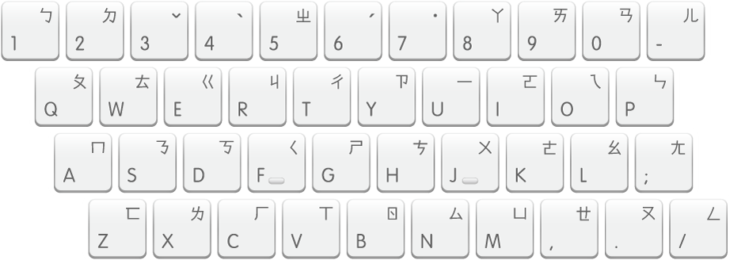

> Author: Qijia Fan

本文是为了帮助习惯使用汉语拼音的读者学习注音符号而写的学习笔记，希望能让读者更好地了解汉字标音系统的发展历史与发音逻辑。

## 背景
**注音符号**（Bopomofo）是由清末民初的语言学家设计的一套用于标注汉字读音的符号系统，于 1918 年由当时教育部正式颁布。其英文名称「Bopomofo」取自前四个符号的读音：ㄅ（b）、ㄆ（p）、ㄇ（m）、ㄈ（f）。目前的使用情况大致如下：

- 在中国大陆，注音符号自 1958 年起逐步由汉语拼音取代，但在字典等工具书中仍有标注。以个人观察而言，大陆部分建国前后出生的长辈仍能辨识并使用注音符号，年轻一代则对此较为陌生。
- 在台湾地区，注音符号至今仍广泛应用于学校教育与日常生活。

## 注音符号表与拼读
注音符号表由声母、介母、韵母和声调符号组成，其中介母与韵母在汉语拼音中合称为韵母。接下来我们分别给出注音符号表与汉语拼音的对应关系，并说明一些拼读规则。

### 声母
接下来的两个表格依照注音符号在注音键盘上的排列顺序排列，共 6 + 5 列（栏），每一列（栏）的表头表示该列（栏）的第一个符号在注音键盘上的位置（参见下一节）。

| `1` | `2` | `3` | `4` | `5` | `6` |
| --- | --- | --- | --- | --- | --- | 
| **ㄅ** b | **ㄉ** d |  |  |  **ㄓ** zh(i) |  |
| **ㄆ** p | **ㄊ** t | **ㄍ** g | **ㄐ** j | **ㄔ** ch(i) | **ㄗ** z(i) |
| **ㄇ** m | **ㄋ** n | **ㄎ** k | **ㄑ** q | **ㄕ** sh(i) | **ㄘ** c(i) |
| **ㄈ** f | **ㄌ** l | **ㄏ** h | **ㄒ** x | **ㄖ** r(i) |  **ㄙ** s(i) |

### 介母与韵母

| `7` | `8` | `9` | `0` | `-` |
| --- | --- | --- | --- | --- |
|     | **ㄚ** a | **ㄞ** ai | **ㄢ** an | **ㄦ** er |
| **ㄧ** y/i | **ㄛ** o | **ㄟ** ei | **ㄣ** en |  |
| **ㄨ** w/u | **ㄜ** e | **ㄠ** ao | **ㄤ** ang |  |
| **ㄩ** yu/ü | **ㄝ** ê | **ㄡ** ou | **ㄥ** eng |  |

在上表中，7 列为介母，其余的列为韵母。

读者可能会注意到，部分汉语拼音中的韵母（如 in(g), ong 等）并未在上表中出现，而这些韵母在注音符号中是由介母与韵母组合而成的，具体见之后的拼读规则说明第 3 条。

### 声调
注音符号的声调标注与汉语拼音略有不同。在汉语拼音中，阴平、阳平、上声、去声分别用 「ˉ」「ˊ」「ˇ」「ˋ」四个符号标注，未标注声调符号表轻声；而在注音符号中，阳平、上声、去声仍用「ˊ」「ˇ」「ˋ」符号标注，但阴平通常不标注声调符号「ˉ」，而轻声需用「˙」符号标注：

| 标音系统 | 阴平 | 阳平 | 上声 | 去声 | 轻声 | 
| --- | --- | --- | --- | --- | --- |  
| 汉语拼音 |  ā | á | ǎ | à | a |
| 注音符号 | ㄚˉ/ㄚ | ㄚˊ | ㄚˇ | ㄚˋ | ㄚ˙ |

### 拼读规则说明

1. 该系统区分两种 i：[i] 与 [ɨ]（例如 si），后者直接用声母（不应在后加「ㄧ」）。
    > 例：「智」的注音为「ㄓˋ」而非「ㄓㄧˋ」。
2. ㄝ（ê）是 /ɛ/，如「欸」「诶」等，也是 -ei, -ie/ye, -üe/yue 中 e 的实际发音，故 -ie/ye, -üe/yue 的注音分别为「ㄧㄝ」「ㄩㄝ」。
    > 例：「谢」的注音为「ㄒㄧㄝˋ」而非「ㄒㄧㄜˋ」。
3. -ian/yan, -üan/yuan 的注音还是「ㄧㄢ」「ㄩㄢ」，可以理解为汉语拼音与注音符号系统均不区分 an 与 "ên"。
4. -in/yin, -ing/ying, -ong, -iong/yong 应分别理解为 -ien（ㄧㄣ）, -ieng（ㄧㄥ）, -ueng（ㄨㄥ）, -üeng（ㄩㄥ）。
    > 例：「红」的拼音和注音分别为「hóng」「ㄏㄨㄥˊ」；「穷」的拼音和注音分别为「qióng」「ㄑㄩㄥˊ」。
5. iu, ui, un (ün) 分别是 iou, uei, uen (üen) 的缩略形式。

## 注音输入法
注音输入法的键位排列与注音符号表的排列顺序高度一致，见下图：

<!--  -->

其中，`3`、`4`、`6`、`7` 四个键位呼应了上一节注音符号表中的预留空格，用于输入声调，阴平则用 Space 键输入（对应不标注声调符号）。

TODO